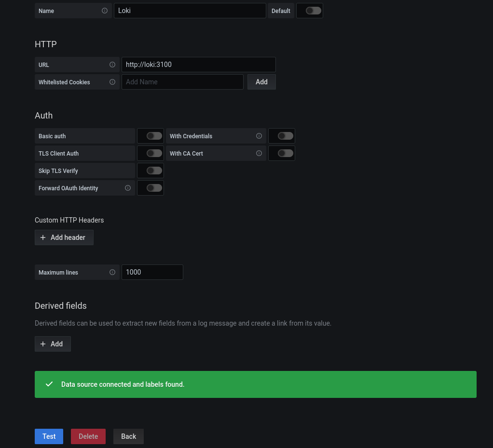
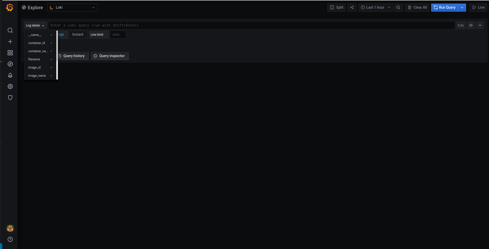
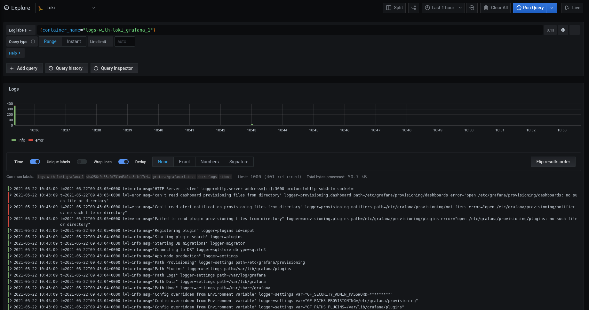

# Logs with Loki

This repo contains the source code for my article [Better docker logs with Loki](https://brunopaz.dev/blog/better-docker-logs-with-loki), which demonstrates how to use Grafana Loki for better Docker Logs during development.

## Pre-Requisites

* [Docker](https://www.docker.com/)
* [Docker Compose](https://docs.docker.com/compose/)


## Running the project

```sh
git clone https://github.com/brpaz/logs-with-loki
cd logs-with-loki
docker-compose up -d
```

This will start Grafana, Loki, Promtail and a Sample demo app using [ealen/echo-server](https://hub.docker.com/r/ealen/echo-server).


## Gettings the logs

You can access your Grafana Dashboard, by going to `localhost:3000` and login with `admin/testloki`.

The Loki datasource should already configured: (you can check it by navigating to: http://localhost:3000/datasources).

If you click on Loki datasource, and go down, press the "Test" button to ensure that Grafana can communicate with Loki.




Then open "Explore" tab on the left, and you will see Loki interface.


If you click "Log labels", you should see some labels already populated from the Docker images.



The most useful one is the "container_name". Select one of the containers like `logs-with-loki_grafana_1` and you should see the respective logs appear.





## Learn more

* [Introduction to Loki: Like Prometheus, but for Logs | Grafana Labs](https://grafana.com/go/webinar/intro-to-loki-like-prometheus-but-for-logs/?pg=oss-loki&plcmt=hero-txt)
* [Install Loki with Docker or Docker Compose](https://grafana.com/docs/loki/latest/installation/docker/)
* [LogQL Cheat sheet](https://megamorf.gitlab.io/cheat-sheets/loki/)


## License

[MIT](LICENSE)